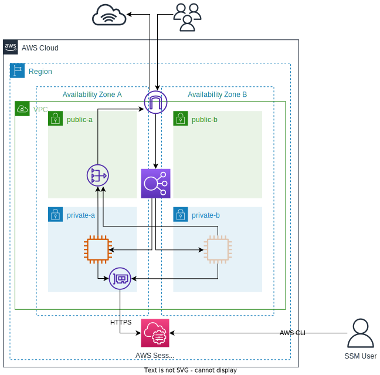

# aws-ec2-example

Creates one or more web servers across AZs in a region. Web servers can be accessed via [AWS Systems Manager Agent](https://docs.aws.amazon.com/systems-manager/latest/userguide/what-is-systems-manager.html) (SSM Agent) from within private subnets, so there is no need to use a bastion host or SSH.

# Architecture


## Usage

1. If using Terraform Cloud (TFC), create workspace named `aws-ec2-example-dev`, 
   `aws-ec2-example-test` or `aws-ec2-example-prod` and attach to (fork of) this GitHub repo.
2. Configure the required inputs as environment variables or create `*.auto.tfvars` file.
3. Rename `backend.tf.example` to `backend.tf` and configure for your workspace/backend.
4. Push changes to branch associated with workspace.
5. Plan and Apply Terraform configuration.

### Required inputs

| Variable                | Description                                 |
|-------------------------|---------------------------------------------|
| `AWS_ACCESS_KEY_ID`     | Access Key for AWS IAM user.                |
| `AWS_SECRET_ACCESS_KEY` | Secret Access Key for AWS IAM user.         |
| `vpc_cidr_block`        | The CIDR of the VPC.                        |
| `solution_name`         | Overall name for the solution (no spaces).  |
| `owner`                 | The name of the solution owner.             |
| `owner_email`           | The email address of the solution owner.    |

### Optional inputs

| Variable          | Description                  | Default     |
|-------------------|------------------------------|-------------|
| `region`          | AWS region to build in.      | `eu-west-2` |
| `instance_type`   | EC2 instance type to use.    | `t2.micro`  |
| `num_web_servers` | Total number of web servers. | `1`         |

## Outputs

| Variable            | Description                       |
|---------------------|-----------------------------------|
| `instance_arn`      | List of web server instance ARNs. |
| `instance_ids`      | List of web server instance IDs.  |
| `ssm_username`      | User that can access EC2 via SSM  |
| `lb_public_address` | Public URL of load balancer       |

## Using SSM

- Install the [Session Manager Plugin](https://docs.aws.amazon.com/systems-manager/latest/userguide/session-manager-working-with-install-plugin.html) for AWS CLI.

- Run the following from the CLI:
```bash
# To get instance IDs
aws ec2 describe-instances --filters Name=instance-state-name,Values=running \
   --query 'Reservations[*].Instances[*].{Instance:InstanceId,Name:Tags[?Key==`Name`]|[0].Value}' \
   --profile $SSM_USER_PROFILE \
   --output text --region eu-west-2
# To start session
aws ssm start-session --target $INSTANCE_ID --profile $SSM_USER_PROFILE --region eu-west-2
```